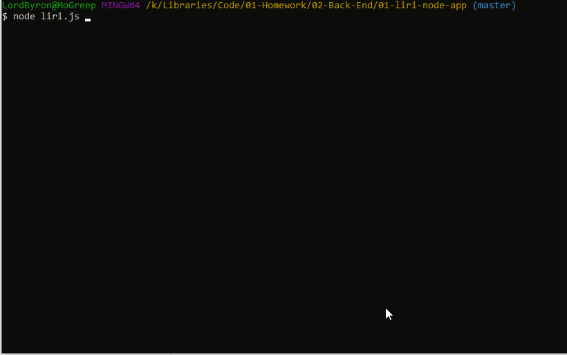

# 01-liri-node-app
  
## Table of contents
  
### 1-Description
### 2-App in Action
### 3-Technologies
### 4-Challenges

### 1-Description
Ask Liri is a Command Line Interface (CLI) Node app that interacts via the backend with three APIs: Twitter, Spotify, and Open Movie Database (OMDb). It allows the user to search for song data, movie data, other people's tweets, their own tweets, and to post new tweets. It also allws for a random action pulled from a .txt file.

### 2-App in Action

### 3-Technologies
  This project utilizes the following technologies:
- Vanilla JavaScript
- [Node.js](https://nodejs.org/en/)
- Node packages
- Web APIs

### 4-Challenges
The challenge of this project was two-fold: getting familiar with Node, and learning backend API calls, which function differently than front-end AJAX calls. It was my first foray into Node and Node packages using npm.